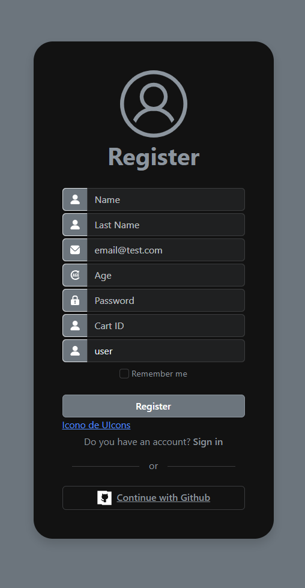
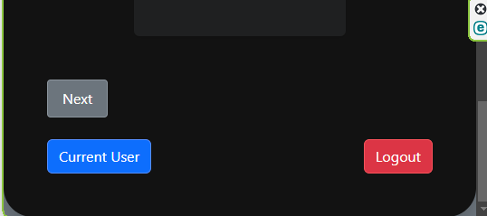

# Ingresar al login
>"Colocar el Email y Password 🔥"
[Por ejemplo   ](http://localhost:8080/)
http://localhost:8080

# Registrar un usuario
>"Dar click en register y llenar los campos , asegurate que el cart exista 🔥"
[Por ejemplo   ](http://localhost:8080/register)
http://localhost:8080/register

# Verificar Current User y salir con Logout
>"Dar click en Current User para ver los datos del usuario , dar click en Logout para salir🔥"

# Usuarios
>"Para Agregar un usuario🔥"
[En Postman colocar POST y digitar ](http://localhost:8080/api/users/)
http://localhost:8080/api/users/

  ~~~
{
        "first_name": "Karen",
        "last_name": "Castro",
        "email": "karen@test.com",
       "age": 38,
        "password": "123",
        "cart": "6670bd35e905e0b96e5c8878"
        }
~~~

>"Para hacer login🔥"
[En Postman colocar POST y digitar ](http://localhost:8080/api/auth/login)
http://localhost:8080/api/auth/login

  ~~~
{
        "email": "erland@test.com",
        "password": "123"
        }
~~~

>"Para ingresa a /current🔥"
[En Postman colocar GET y digitar ](http://localhost:8080/api/auth/current)
http://localhost:8080/api/auth/current
Nos mostrara en pantalla el siguiente modelo

  ~~~
{
    "message": "Bienvenido",
    "user": {
        "first_name": "Erland",
        "last_name": "Ruiz",
        "email": "erland@test.com",
        "role": "user",
        "iat": 1721597074,
        "exp": 1721597374
    }
}
~~~

>"Para mostrar todos los usuarios🔥"
[En Postman colocar GET y digitar ](http://localhost:8080/api/users/)
http://localhost:8080/api/users/

>"Para Traer un usuario por ID, por ejemplo con id **669d79cd911194cbae23831e**🔥"🔥"
[En Postman colocar GET y digitar ](http://localhost:8080/api/users/669d79cd911194cbae23831e)
http://localhost:8080/api/users/669d79cd911194cbae23831e

>"Para salir del usuario🔥"
[En Postman colocar GET y digitar ](http://localhost:8080/api/auth/logout)
http://localhost:8080/api/auth/logout

# Carrito
>"Para crear un carrito vacio🔥"
[En Postman colocar POST y digitar ](http://localhost:8080/api/carts)
http://localhost:8080/api/carts

>"Para Traer todos los carritos🔥"
[En Postman colocar GET y digitar ](http://localhost:8080/api/carts)
http://localhost:8080/api/carts

>"Para Traer un carrito por ID por ejemplo con id **6670bbaa5d2e6b942e08e5cd**🔥"🔥"
[En Postman colocar GET y digitar ](http://localhost:8080/api/carts/6670bbaa5d2e6b942e08e5cd)
http://localhost:8080/api/carts/6670bbaa5d2e6b942e08e5cd

>"Para Agregar un product con productId **6671ff8a087e8f281bff71c2** a un carrito  cartId **6670bbaa5d2e6b942e08e5cd**🔥"🔥"
[En Postman colocar POST y digitar ](http://localhost:8080/api/carts/6670bbaa5d2e6b942e08e5cd/products/6671ff8a087e8f281bff71c2)
http://localhost:8080/api/carts/6670bbaa5d2e6b942e08e5cd/products/6671ff8a087e8f281bff71c2

>"Para eliminar un carrito por ID por ejemplo con id **6670bbaa5d2e6b942e08e5cd**🔥"
[En Postman colocar DELETE y digitar ](http://localhost:8080/api/carts/6670bbaa5d2e6b942e08e5cd)
http://localhost:8080/api/carts/6670bbaa5d2e6b942e08e5cd

>"Para Remover un product con productId **6671ff8a087e8f281bff71c2** de un carrito con cartId **6670bbae5d2e6b942e08e5cf**🔥"🔥"
[En Postman colocar POST y digitar ](http://localhost:8080/api/carts/6670bbae5d2e6b942e08e5cf/products/6671ff8a087e8f281bff71c2)
http://localhost:8080/api/carts/6670bbae5d2e6b942e08e5cf/products/6671ff8a087e8f281bff71c2

>"Para Actualizar la cantidad de un product con productId **6671ffa0087e8f281bff71c8** que esta en un carrito con cartId **6670bbae5d2e6b942e08e5cf**🔥"🔥"
[En Postman colocar PUT y digitar ](http://localhost:8080/api/carts/6670bbae5d2e6b942e08e5cf/products/6671ffa0087e8f281bff71c8)
http://localhost:8080/api/carts/6670bbae5d2e6b942e08e5cf/products/6671ffa0087e8f281bff71c8

  ~~~
{
    "quantity": 20
    }
~~~

>"Para Remover todos los productos de un carrito 🔥 con cartId **6670bcb15d2e6b942e08e5d1**"
[En Postman colocar DELETE y digitar ](localhost:8080/api/carts/clear/6670bcb15d2e6b942e08e5d1)
localhost:8080/api/carts/clear/6670bcb15d2e6b942e08e5d1

# Producto
>"Para actualizar un carrito con cartId🔥**6670bbae5d2e6b942e08e5cf**"
[En Postman colocar PUT y digitar ](http:localhost:8080/api/carts/6670bbae5d2e6b942e08e5cf)
localhost:8080/api/carts/6670bbae5d2e6b942e08e5cf

  ~~~
{
        "products": [
            {
                "quantity": 14,
                "product": "6671ff99087e8f281bff71c6"
            },
                {
                "quantity": 20,
                "product": "6671ffa0087e8f281bff71c8"
            }
        ]
    }
~~~

>"Para Agregar un producto🔥"
[En Postman colocar POST y digitar ](http://localhost:8080/api/products)
http://localhost:8080/api/products

  ~~~
 {
        "title": "Pantalon drill negro",
        "description": "Pantalon de trabajo color negro  ",
        "code": "abc001",
        "price": 300,
        "stock": 35,
        "category": "ropa",
        "thumbnails": ["www.imagen1.com","www.imagen2.com"]
    } 
~~~

>"Para Traer todos los productos🔥"
[En Postman colocar GET y digitar ](http://localhost:8080/api/products)
http://localhost:8080/api/products

>"Para Traer todos los productos ascendente de precio🔥"
[En Postman colocar GET y digitar ](http://localhost:8080/api/products?sort=asc)
http://localhost:8080/api/products?sort=asc

>"Para Traer todos los productos por categoria🔥"
[En Postman colocar GET y digitar ](http://localhost:8080/api/products?category=lentes)
http://localhost:8080/api/products?category=lentes

>"Para traer un producto por ID por ejemplo con id **6671c526a1e1a583b041a208**🔥"
[En Postman colocar GET y digitar ](http://localhost:8080/api/products/6671c526a1e1a583b041a208)
http://localhost:8080/api/products/6671c526a1e1a583b041a208

>"Para Actualizar  un producto por ejemplo con id **6671c526a1e1a583b041a208**🔥"
[En Postman colocar PUT y digitar ](http://localhost:8080/api/products/6671d9126d02ff771662879d)
http://localhost:8080/api/products/6671d9126d02ff771662879d

  ~~~
  {
            "title": "Casco Safari nuevo" ,
            "description": "Casco Safari color amarillo  ",
            "code": "abc006",
            "price": 800,
            "status": true,
            "stock": 15,
            "category": "casco",
            "thumbnails": ["www.imagen1.com","www.imagen2.com"]      
  }
~~~

>"Para eliminar un producto por ID por ejemplo con id **6671ff88087e8f281bff71c0**🔥"
[En Postman colocar DELETE y digitar ](http://localhost:8080/api/products/6671ff88087e8f281bff71c0)
http://localhost:8080/api/products/6671ff88087e8f281bff71c0

